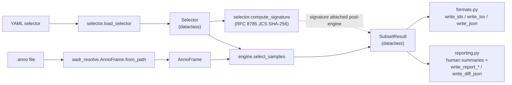
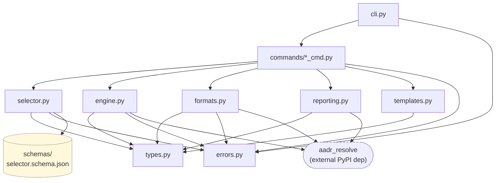
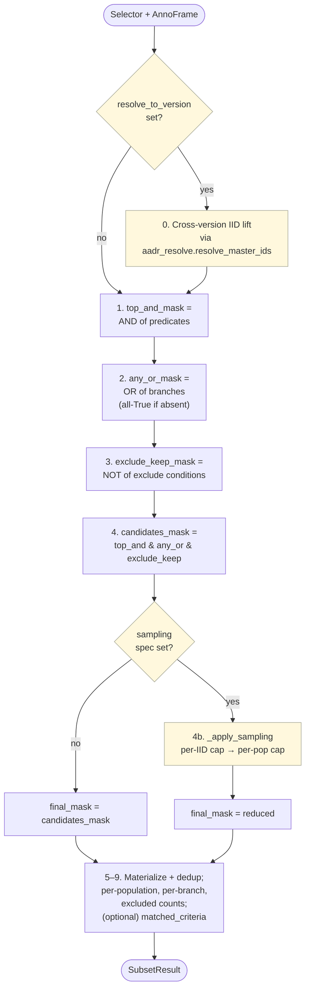

# DEVELOPMENT.md

Orientation guide for picking up the `aadr-subset` codebase. Read this
once; refer back when you need to make a change. For dev setup, lint,
tests, and release flow see [CONTRIBUTING.md](CONTRIBUTING.md); for
user-facing usage see [README.md](README.md).

## What this tool is, in one paragraph

`aadr-subset` takes an AADR `.anno` file (a wide TSV of ~30k ancient-DNA
samples × ~80 columns) and a YAML "selector" (a declarative filter
spec), and emits the list of sample IDs that match the selector. The
selector is the unit of cohort definition — it's hashed into a stable
`selector_signature` so two researchers running the same YAML against
the same `.anno` always get the same cohort. Everything else (subcommands,
output formats, cross-version lifts, sampling caps) hangs off this core.

## 30-second mental model



`compute_signature` reads the `Selector` directly (not the
`SubsetResult`); `run_select` attaches the resulting hash to the
result via `dataclasses.replace` before handing it to the writers.

Three things to internalize:

1. **`Selector` is the parsed user intent.** Every filter feature
   surfaces as a field on the `Selector` dataclass in `types.py`. The
   engine consumes a `Selector`, not a dict.

2. **`AnnoFrame` is `aadr-resolve`'s wrapper around the `.anno` TSV.**
   We import it; we don't subclass it. The accessors we depend on are
   `genetic_id`, `individual_id`, `group_id`, `date_calbp`, `coverage`,
   `coverage_via(column)`, `schema_class`, `version`, `n_rows`, `path`.
   Schema class A/B/C/D/E controls which native columns exist (class D
   = v62 with no native coverage column; the rest carry coverage).

3. **`SubsetResult` is the engine's output contract.** It's the data
   that flows into every output writer and every reporting formatter.
   Adding a feature usually means adding a field to `SubsetResult` and
   threading it through the writers.

## Module map

| File | Role | LOC |
|---|---|---|
| `types.py` | Dataclasses + enums. Leaf in the dep graph; imports nothing from the package. | ~270 |
| `errors.py` | Exception hierarchy + `EXIT_*` constants + `ValidationError`. | ~100 |
| `schemas/selector.schema.json` | JSON Schema for selector YAML; source of truth for the grammar surface. | — |
| `selector.py` | YAML → `Selector`. Loader, schema validator, semantic-constraint checker, IID-source-file loader, **signature computation**, error formatter. | ~850 |
| `engine.py` | `select_samples(anno, selector, …) → SubsetResult`. The filter pipeline (predicate masks → exclude → sampling → dedup → accounting). Owns the cross-version lift and the glob expansion. | ~960 |
| `formats.py` | `write_select_output` dispatch + `write_ids` / `write_tsv` / `write_json`. Owns `atomic_write` (tempfile + fsync + rename, advisory `flock`). | ~310 |
| `reporting.py` | `format_stdout_summary`, `format_inspect_summary`, `format_diff_summary`, `write_report_*`, `build_diff_result`. Everything human-readable. | ~635 |
| `templates.py` | Loader/lister for the bundled `templates/*.yaml`. Distinct from the directory. | ~80 |
| `templates/` | Shipped starter selectors (two-doc YAML: metadata header + body). | — |
| `cli.py` | `click` group + per-subcommand entry points. Wires flags → `commands/run_*`; top-level `AadrSubsetError` handler maps exceptions → exit codes. | ~520 |
| `commands/{validate,select,inspect,report,diff,template}_cmd.py` | One orchestrator per subcommand. Each `run_*` takes flat kwargs and returns an int exit code. | ~40-390 each |

The dep graph is acyclic. `types.py` and `errors.py` are leaves;
`selector.py` and `engine.py` depend only on those two (plus
`aadr_resolve` for `engine`); `formats.py` and `reporting.py` depend
on the data layer plus `aadr_resolve`; `commands/*` depend on
everything and are imported only by `cli.py`.



Arrows point from importer to imported. Reading top-down: `cli.py`
sits above the orchestrators, which sit above the data/output layer,
which sits on the leaves. No cycles.

## The execution pipeline (engine.select_samples)

The full algorithm is in `engine.select_samples` (~210 lines, well
commented). Step numbering below matches the `# N.` comments in the
code; v0.3 inserted sampling between the pre-sampling mask and the
materialize step as **step 4b** so existing pin numbers (5+ in the
code) didn't shift.



The two yellow conditionals are the only branching: the cross-version
IID lift fires only when `resolve_to_version:` is in the selector, and
the sampling reduction fires only when a sampling spec (selector-side
or via CLI) is present. The masks chain (steps 1–4) and the accounting
block (5–9) always run.

0. **Cross-version IID lift** — if `selector.resolve_to_version` is set,
   call `aadr_resolve.resolve_master_ids` to lift the selector's source
   Individual_IDs to target Individual_IDs. The target set replaces
   `selector.individual_ids` in step 1.
1. **Top-level AND mask** — `_build_predicate_mask` combines per-field
   sub-masks (populations, individual_ids, modern_only, min_coverage,
   date) with logical AND. Each sub-mask is built only when its field
   is set.
2. **`any:` OR mask** — `_build_any_or_mask` produces one sub-mask per
   branch and ORs them. Absent `any:` block yields all-True.
3. **`exclude:` NOT-of-OR mask** — same shape as `any:` but inverted.
4. **`candidates_mask = top_and & any_or & exclude_keep`** — the
   pre-sampling final mask.
4b. **(v0.3) Stratified sampling** — `_apply_sampling` runs the
    per-individual cap first, then the per-population cap. Both
    prioritize via `_coverage_series(af, coverage_column)` (so the
    effective coverage column — selector override > CLI override > native
    `af.coverage` — drives ranking), sort descending with NaN sinking
    last, and take the top N. Stable sort means ties break on `.anno`
    row order. NaN-`group_id` rows bypass the per-population cap (no
    sensible "group" to cap within); they still participate in the
    per-individual cap. The output is `final_mask`.
5. **Materialize + dedup** — `anno.genetic_id[final_mask]` → list;
   `_dedup_preserve_order` handles the (defensive) GID-uniqueness check.
6. **Per-population counts** — built from the matched group_ids in
   first-appearance order.
7. **Per-branch counts** — `_compute_per_branch_counts`, AND-ed with
   `final_mask` so sampling-dropped rows don't inflate any branch's count.
8. **Excluded counts** — one row per exclusion *condition* (literal or
   expanded glob), independent of overlap with the matched set.
9. **Optional `matched_criteria`** — opt-in via `select`'s
   `--include-matched-criteria` flag (it's O(n × predicates), so off by
   default; `inspect` and `report` don't expose it).

### Tri-state populations (important)

`_build_predicate_mask`'s `populations` parameter is **tri-state**:
- `None` → no constraint (skip the sub-mask).
- `[]` → constraint was set but resolved to zero groups (e.g. a glob
  matched nothing) → contribute all-False, not all-True.
- non-empty list → `af.group_id.isin(populations)`.

The empty case is why `_expand_if_set` returns `None` for an empty
literal list: an absent constraint and a zero-resolved constraint must
look different to the mask builder. Globs that expand to zero are also
accumulated in `empty_glob_patterns` for the stderr warning.

### Glob expansion

`_expand_group_id_patterns` treats any string containing `*`, `?`, or
`[` as an fnmatch pattern against the target `.anno`'s Group_IDs. Both
the top-level `populations:` and each `any:` branch's `populations:`
get expanded with the same accumulator. Literal labels pass through.
The signature hashes the **pattern**, not the expanded set (see below).

## Key data structures

### `Selector` (types.py)

The parsed user intent. Construct via `load_selector(path)` — direct
construction is for test fixtures only.

Absent-vs-present discipline (subtle and important):
- **Scalar fields** (`min_coverage`, `modern_only`, etc.) → `None` for
  absent; an actual value for present.
- **Sub-block fields** (`date`, `exclude`, `sampling`) → `None` for
  absent; an instance of the sub-dataclass for present.
- **List-typed predicate fields** (`populations`, `individual_ids`,
  `exclude.group_ids`, …) → `[]` for absent. The JSON Schema rejects
  present-but-empty lists in YAML, so the only way to get `[]` at this
  layer is "field omitted from the YAML." Engine code reads `[]` as
  "no constraint set for this field."

Subtle ID-source-file semantics:
- `individual_ids` is the YAML-inline list.
- `individual_ids_source` is a Path to a newline-delimited file.
- `individual_ids_from_source` is the parsed contents of the file.
- The engine + signature UNION the first and third independently; the
  source-file path itself is not signature-relevant (the *content* is).

### `SubsetResult` (types.py)

The engine's return value. Frozen, slotted. The writers and reporters
read it; they never mutate it. Where a caller needs to "add a field"
(e.g. `select_cmd.run_select` attaching `anno_version` /
`selector_signature` post-engine), it uses `dataclasses.replace(result,
field=value, …)` — the stdlib pattern for constructing a new frozen
dataclass from an existing one with overrides.

### `AnnoFrame` (aadr_resolve)

Not ours — an external PyPI dependency from `aadr-resolve`, treated as
a black-box dataframe wrapper. Test code stands in with `FakeAnnoFrame`
(`tests/unit/test_engine.py`) duck-typing the accessors we use.

## The selector signature contract

`selector.compute_signature(selector, *, cli_coverage_column, cli_max_per_population, cli_max_per_individual)`
is the **public contract** that defines reproducibility. It produces
`"sha256:" + hashlib.sha256(rfc8785.dumps(payload)).hexdigest()` where
the `payload` dict is built per these rules (referenced as "LLD §3.3"
in `selector.py`; the historical design pins from build-time live in
inline comments now):

- Set-like lists (`populations`, `individual_ids`, `exclude.group_ids`,
  `exclude.individual_ids`) are sorted-deduped to break input ordering noise.
- Order-sensitive lists (`any` branches) preserve their order
  (per-branch counts are indexed `any[0]`, `any[1]`, …).
- `individual_ids` is the UNION of `selector.individual_ids` +
  `selector.individual_ids_from_source`. The source-file path is dropped.
- `coverage_column` follows selector-wins-over-CLI; CLI fallback is
  injected when the selector has no override.
- `sampling` sub-dict follows the same per-field selector-vs-CLI merge.
  `policy: top_coverage` is elided when default — so explicit and
  omitted produce equal hashes. This keeps the signature space stable
  when a future `policy: random` lands.
- Metadata block (cohort-irrelevant prose) is dropped.
- Glob patterns hash by **pattern, not expansion** — same selector
  produces the same hash against v62 vs v66 even when the resolved
  Group_IDs differ. Sampling caps follow the same intent-not-expansion
  rule.

**Any change that would alter the canonical form for existing selectors
is a breaking change** and needs a major version bump discussion. Pure
*additions* (a new optional field that's elided when absent) are safe
because elided keys don't enter the payload.

## Where to add things

Every recipe below ends with a `CHANGELOG.md` entry under
`[Unreleased]` (recreate that section if the previous version was
just released).

### A new filter predicate (e.g. `min_n_snps_hit`)

1. Add the field to `Selector` (and `AnyBranch` if it should work in
   `any:` branches) in `types.py`.
2. Add the property to the JSON Schema (`schemas/selector.schema.json`),
   under `properties` at the root and under `$defs.branch.properties` —
   plus add it to the `_check_semantic_constraints` function in
   `selector.py` if it interacts with another field.
3. Parse it in `_build_selector` (`selector.py`) → set the field on the
   returned `Selector`. If you're *renaming* an existing field rather
   than adding one, extend `_DEPRECATED_ALIASES` so old YAMLs still
   load (with a stderr warning) for at least one minor version before
   removal — `master_ids` → `individual_ids` was handled this way.
4. Build a sub-mask in `_build_predicate_mask` (`engine.py`); add it to
   the masks list when the field is set.
5. If the field should appear in `any:` branches, mirror the construction
   in `_build_any_or_mask`.
6. Add the field to `compute_signature`'s payload (`selector.py`); decide
   on canonical form (sorted-set, scalar, dict). Elide when absent.
7. Tests: unit tests in `tests/unit/test_engine.py` for the mask
   behavior, `test_signature_canonicalization.py` for the signature,
   `test_schema_validation.py` for the schema reject cases.
8. Update `CHANGELOG.md` under `[Unreleased]`.

### A new subcommand

1. Add `src/aadr_subset/commands/<name>_cmd.py` exposing `run_<name>(**kwargs) -> int`.
   Thread `quiet` through if your subcommand writes a stderr summary
   (top-level `--quiet` should suppress it; see existing commands for
   the pattern).
2. Register it in `cli.py` with `@cli.command("<name>")` + click options;
   the body calls `run_<name>(**)` and `sys.exit(exit_code)`.
3. Add an entry to the README's subcommands section — and bump the
   section heading count ("The six subcommands" → "The seven
   subcommands"), plus the bullet in the *Why it exists* list.
4. Tests: unit test the orchestrator (`tests/unit/test_<name>_cli.py`)
   via `click.testing.CliRunner`.
5. Update `CHANGELOG.md` under `[Unreleased]`.

### A new output format

1. Add an enum value (`OutputFormat.YOURNAME` in `types.py`).
2. Add a `write_<name>` function in `formats.py` taking `(SubsetResult,
   AnnoFrame, out_path: Path | None)` and using `atomic_write` for
   non-stdout writes.
3. Add a branch in `write_select_output`'s dispatch.
4. Extend `format_stdout_summary`'s "Wrote …" line if the new format
   reports differently.
5. If you change the JSON output's *shape* (rather than just adding
   a new format), bump `formats.JSON_SCHEMA_VERSION` and update the
   key-order test (`tests/unit/test_formats_tsv_json.py`).
6. Update `CHANGELOG.md` under `[Unreleased]`.

### A new shipped template

A shipped template is a **two-document YAML**, separated by `---`:

```yaml
# Brief commentary about what this cohort represents.
tested_against: [v62.0, v66.0]   # AADR versions where this resolves non-empty
last_verified: '2026-05-12'      # ISO date (string-quoted)
maintainer: aadr-subset          # or your name
notes: |
  Free-form block-scalar prose. Explain edge cases, suggested edits,
  coverage-column requirements. Surfaces in `template <name>` output.
---
# Body — the actual selector YAML the user gets a copy of.
populations: ["..."]
date: {min_calbp: ..., max_calbp: ...}
...
```

Steps:

1. Drop `templates/<name>.yaml` with the two-doc structure above. The
   metadata keys (`tested_against` / `last_verified` / `maintainer` /
   `notes`) all map onto `types.SelectorMetadata`.
2. Verify it produces non-zero matches against every AADR version in
   `tested_against:` — `tests/integration/test_templates_against_real_anno.py`
   asserts this for every shipped template (gated on the integration
   `.anno` fixtures being available).
3. The `templates.py` lister picks up any `*.yaml` in the directory; no
   code change required.
4. Update `CHANGELOG.md` under `[Unreleased]`.

### A new schema class (v66 adds a new class F, say)

You won't add it here — schema-class detection lives in `aadr-resolve`.
But when a class lands there, audit:
- `_apply_sampling`'s class-D guard (`af.schema_class.value == "D"`) —
  may need extension if the new class is also coverage-less.
- `select_cmd._emit_v62_coverage_warning_if_needed` — the warning is
  class-keyed.
- Integration tests that pin `class E` strings.

## Error & exit-code model

`errors.py` defines a single exception hierarchy. The CLI top-level
handler is `cli.main()` (the entry point registered as
`aadr-subset = "aadr_subset.cli:main"` in `pyproject.toml`); it wraps
`cli(standalone_mode=False)` in a try/except block that catches
`AadrSubsetError` subclasses and maps to `exit_code`.

| Exception | Exit | When to raise |
|---|---|---|
| (success) | 0 | `EXIT_SUCCESS`. |
| `SoftValidationFailure` | 1 | The engine ran and got an answer, but the answer isn't shippable. Zero-match without `--allow-empty`, `--strict-resolve` with missing IIDs. |
| `IOFailure` | 2 | `.anno` unreadable, schema unrecognized, can't write output, sampling on class-D without `--coverage-derive`. |
| `InvariantViolation` | 3 | Internal consistency check failed — e.g. cross-version lift called without a source `AnnoFrame`. Signals a bug, not user error. |
| `UsageError` | 4 | YAML schema violation, semantic-constraint violation, flag misuse. Carries a `list[ValidationError]` payload for the formatter. |
| (uncaught) | 70 | Escape hatch for genuine bugs. BSD `EX_SOFTWARE`. The CLI handler logs the traceback. |
| (Ctrl-C / `click.exceptions.Abort`) | 130 | Conventional SIGINT exit code. `main()` handles this explicitly. |

Click's own usage errors (bad flag, wrong arg count) exit 2 by default;
`main()` intercepts `click.UsageError` and overrides to 4 so all
usage-style failures share an exit code.

## stdout vs stderr discipline

Strict separation, so pipelines compose:

- **stdout** — only data the user asked for. Selector matches (IDs /
  TSV / JSON) when `-o` is omitted; report rows when `-o` is omitted;
  diff body when `-o` is omitted. Tools downstream (`plink2 --keep`,
  `jq`, `wc -l`) read this stream.
- **stderr** — summaries, warnings, validation errors, the `Wrote …`
  / `Done in …` lines. Suppressible with top-level `--quiet`.

Concretely: `format_stdout_summary` (despite the name — historical)
writes to **stderr** in `select_cmd`. `write_select_output` writes the
matched-IDs / TSV / JSON to **stdout** when `out_path is None`, or
atomically to the `-o` path otherwise. Adding a subcommand: route
data to stdout, narration to stderr, and honor `--quiet` on the
narration path.

## Testing strategy

Two tiers:

- **Unit tests** (`tests/unit/`) — fast, no filesystem `.anno`. They
  use `FakeAnnoFrame` (a dataclass duck-typing the engine's `AnnoFrame`
  surface) so they can iterate the engine in milliseconds.

- **Integration tests** (`tests/integration/`) — slower; build a real
  `.anno`-on-disk via `tests/fixtures/synthesize.py`
  (`make_v62_class_d_fixture`, `make_loschbour_v66_fixture`, or
  `write_class_e_anno` with bespoke `SynthRow` lists). These cover the
  cross-version lift, the schema-class auto-detect, and the
  template-against-real-AADR assertions.

Some tests are gated `@pytest.mark.slow` or `@pytest.mark.external_tool`
and excluded from the default `pytest` run; CI's default suite is the
quick path. Coverage gate at 90% line coverage.

Shared pytest fixtures live in `tests/conftest.py`. The two most
useful: `selector_dir` (a tmp_path-scoped directory to drop selector
YAMLs in) and `write_yaml(path, content)` (one-line YAML file builder).
Use them in unit tests instead of hand-rolling `tmp_path /
"selector.yaml"`-style boilerplate.

When adding tests, the unit-tier `FakeAnnoFrame` is almost always
enough. Reach for the synthesizer when you're touching schema-class
detection, the cross-version lift, or the atomic-write behavior — any
case where the actual `.anno` parsing matters.

### Manual end-to-end check

Useful smoke test when poking around. Build a tiny `.anno` + selector
in a scratch directory and run the CLI against it:

```bash
python -c "
from pathlib import Path
from tests.fixtures.synthesize import SynthRow, write_class_e_anno
rows = [
    SynthRow(genetic_id='I001', individual_id='I001', group_id='Iberia_BA',
             date_calbp=4000, coverage=1.2),
    SynthRow(genetic_id='I002', individual_id='I002', group_id='Iberia_BA',
             date_calbp=4200, coverage=0.5),
]
write_class_e_anno(Path('/tmp/demo.anno'), rows)
Path('/tmp/demo.yaml').write_text('populations: [Iberia_BA]\nmin_coverage: 0.3\n')
"
aadr-subset select /tmp/demo.yaml /tmp/demo.anno --format json | jq
```

For larger sanity checks against real `.anno` files, the integration
tests under `tests/integration/` are the reference — they exercise the
full file-on-disk path that unit tests skip.

## What's NOT in the code

A few things you might look for and not find:

- **`docs/hld.md` / `docs/lld.md`**: there isn't one. Inline comments
  reference `HLD §<section>` / `LLD §<pin>` because that's how the
  design was tracked during build, but no separate design doc is
  checked in. **The code comments and the `CHANGELOG.md` entries are
  the source of truth for design intent.** When you see an `HLD §X`
  or `LLD §X` reference, look at the surrounding code + the
  CHANGELOG entry for the version that introduced the feature — those
  together are the design.

- **A logging framework**: stderr writes for warnings, stdout for
  output. The tool is short-lived and shell-composable; structured
  logging is out of scope.

- **A config file / environment overrides**: by design. Everything is
  selector-YAML + CLI flags; the tool produces deterministic output
  from those two inputs.

- **A plugin system**: also by design. The grammar is small and
  PR-reviewable. New features land as core schema additions.

## A note on the `aadr-resolve` dependency

`aadr-resolve` is pinned in `pyproject.toml`'s `[project] dependencies`.
The cross-version IID lift, schema-class detection, and
`AnnoFrame.coverage_via(column)` accessors all live in that library —
when you bump its pin, audit:

- The schema-class enum (`af.schema_class.value`) — the class-D guard
  in `_apply_sampling` and the v62 coverage warning in
  `select_cmd._emit_v62_coverage_warning_if_needed` both hard-code
  `"D"`.
- `resolve_master_ids` signature changes — `engine._resolve_cross_version`
  wraps it.
- New `.anno` columns — `_coverage_series` may need a new branch if a
  new canonical coverage column lands.

`aadr-subset` and `aadr-resolve` are designed to ship together; treat a
major-version bump on either as a coordinated change.

## Quick reference: where to look for X

| What you're touching | Start here |
|---|---|
| Grammar shape (a new YAML key) | `schemas/selector.schema.json`, then `types.py`, then `selector._build_selector` |
| Filter behavior (how a key matches rows) | `engine._build_predicate_mask` (top-level) / `engine._build_any_or_mask` (branches) |
| Cross-version IID lift | `engine._resolve_cross_version`, `aadr_resolve.resolve_master_ids` |
| Glob expansion | `engine._expand_group_id_patterns`, `engine._is_glob` |
| Stratified sampling | `engine._apply_sampling`, `engine._apply_groupby_cap` |
| Output structure (a new JSON field, say) | `formats.write_json` + the JSON_SCHEMA_VERSION constant |
| stderr summary wording | `reporting.format_stdout_summary` / `format_inspect_summary` |
| Exit-code mapping | `errors.py` + `cli.py`'s exception handler |
| Validation error rendering | `selector.format_validation_errors`, `errors.ValidationError.format_line` |
| Signature canonicalization | `selector.compute_signature`, `selector._canonical_any_branch` |
